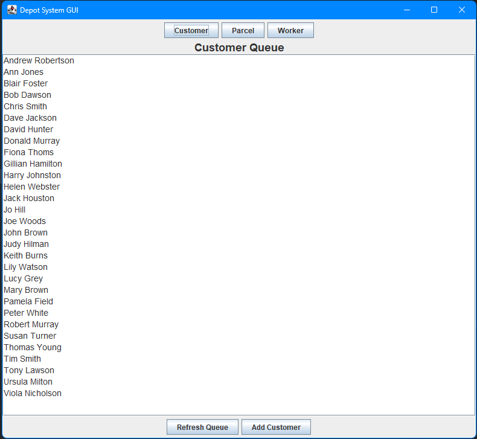
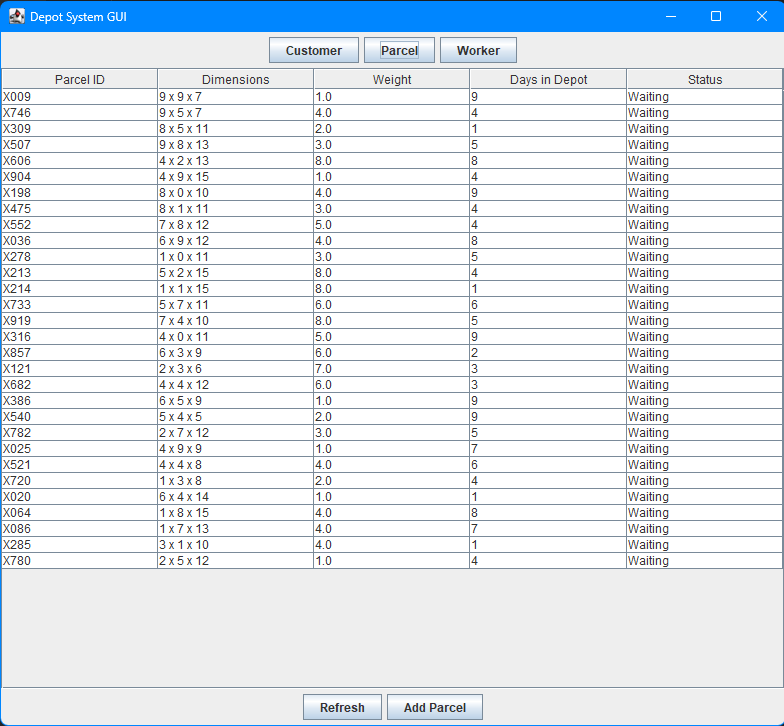
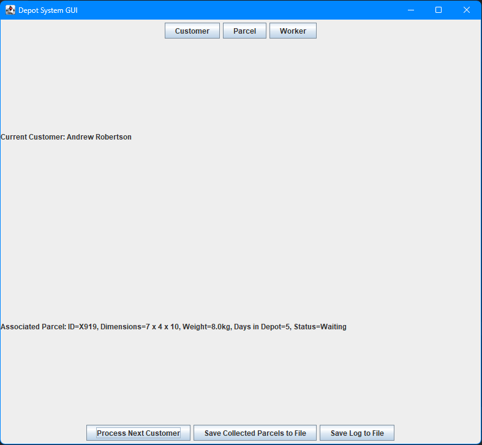

# 📦 Parcel Depot System

A Java-based simulation of parcel management in a depot, designed as part of a **Software Architecture** module. This project demonstrates the use of **three-tier architecture**, **object-oriented design**, and **design patterns** such as Singleton and MVC.

---

## 🧾 Overview

The Parcel Depot System manages parcel tracking and customer interactions in a simulated environment. It processes real-time queues of customers, handles parcel collections, calculates fees, and logs events — all while maintaining separation of concerns via clean architecture.

---

## 🚀 Features

- 📂 **File-Based Initialization** – Loads parcel and customer data from input files.
- 🧑‍💼 **Customer Queue Simulation** – Simulates parcel collection by customers.
- 💰 **Dynamic Fee Calculation** – Computes charges based on parcel attributes.
- 📊 **Report Generation** – Outputs reports of collected and uncollected parcels.
- 📝 **Event Logging** – Uses a Singleton `Log` class to track system activity.

---

## 🛠 Tech Stack
| Technology | Purpose |
|------------|---------|
| **Java** | Core application logic |
| **Singleton Pattern** | Centralized logging system |
| **MVC Architecture** | Separation of concerns |
| **File I/O** | Load and store parcel/customer data |

---

## 🧱 Project Structure

### 🔸 Packages
- `depot.system` — Core application logic and data classes.

### 🔹 Key Classes
| Class           | Purpose |
|----------------|---------|
| `Parcel`        | Stores parcel data like ID, size, and weight. |
| `Customer`      | Represents a customer collecting parcels. |
| `QueueofCustomer` | Manages customer queue and order of processing. |
| `ParcelMap`     | Efficient storage and retrieval of parcels. |
| `Log`           | Singleton logger for event tracking. |
| `Manager`       | Controls the system's flow and coordination. |

---

## 🧠 Design Patterns

- ✅ **Singleton Pattern** — Implemented in the `Log` class for centralized logging.  
- ✅ **MVC Architecture** — Used to support GUI design principles (GUI phase not yet implemented).

---

## 🧪 What I Learned

- Structuring Java programs using **modular architecture**
- Applying **design patterns** in a real-world simulation
- Managing input/output and program flow in a backend-focused Java system

---

## 📷 Screenshots




---

## 🛠️ How to Run

1. Clone the repo:
   ```bash
   git clone https://github.com/yourusername/parcel-depot-system.git
   cd parcel-depot-system
2. Compile and run the Java files using your IDE or CLI
   
